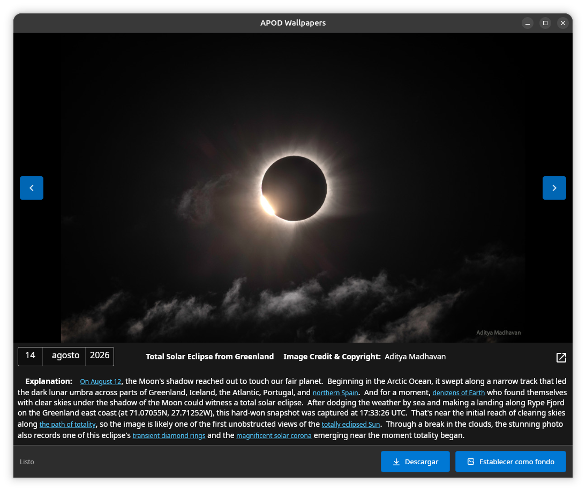

# APOD Wallpapers

> [!NOTE]
> **Desarrollo asistido por IA:** en el desarrollo de esta aplicación se han utilizado herramientas de inteligencia artificial como apoyo.

Aplicación de ejemplo en .NET multiplataforma que descarga la imagen del día de la APOD y da opción de establecerla como fondo de pantalla sin necesidad de navegador. Tiene versión UI o versión de consola, por lo que puede usarse para crear una tarea programada.
